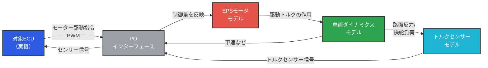
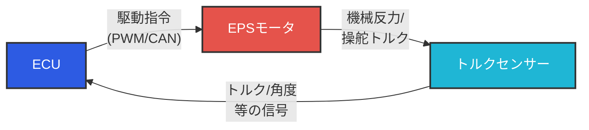
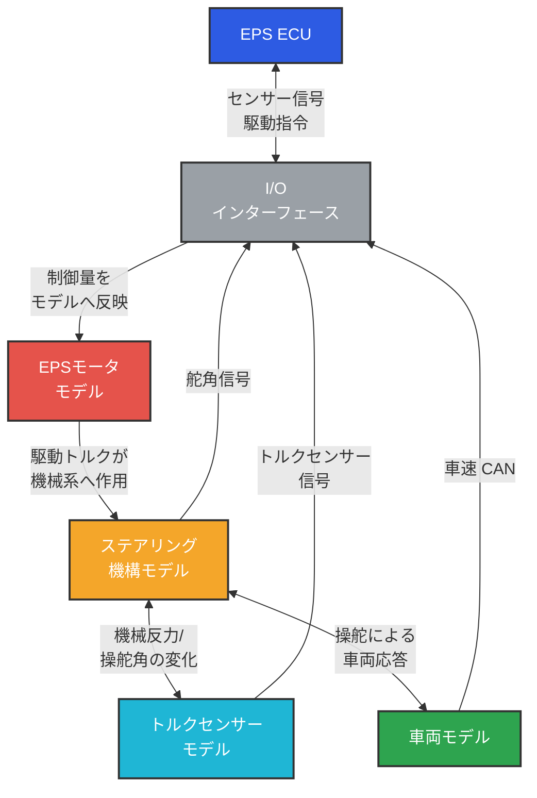
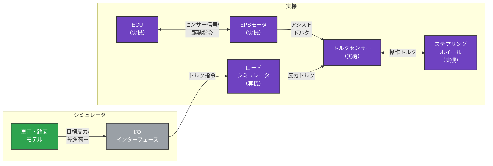

### **研修資料：HILS入門 - 電動パワーステアリング(EPS)制御開発を例に**

**対象者:** 新入社員（配属1年目）。自動車開発に携わる技術者（特にソフトウェア・電子ハードウェア担当者）
**研修時間:** 90分（講義60分＋実演20分＋質疑10分）
**ゴール:** HILSの基本概念とメリットを理解し、自身の業務への活用をイメージできるようになること
**前提知識:** 基本的な電気回路の知識、プログラミングの基礎概念

---

### **【スライド構成案】**

#### **(スライド1) タイトル (1分)**
*   **HILS入門：電動パワーステアリング(EPS)制御開発を例に**
*   講師名：〇〇 〇〇
*   所属：〇〇部 〇〇課
*   日付：2025年8月15日

> **【スピーカーノート】**
> (0:00-1:00)
> 皆さん、こんにちは。ただ今ご紹介にあずかりました、〇〇部の〇〇です。
> 本日はお忙しい中、HILS入門の研修にご参加いただき、ありがとうございます。
> これから約1時間、皆さんの今後の開発業務に必ず役立つ「HILS」という技術について、私の専門である電動パワーステアリングを例にご紹介します。よろしくお願いします。

#### **(スライド2) はじめに (4分)**
*   **私が新人だった頃、こんな壁に直面しました**
    *   実車じゃないとわからない不具合が多く、やっと見つけても修正後の確認でまた試作車を予約…
    *   試作車が使える時間は限られており、先輩に気を使ってしまう…
    *   「この操作をしたら危ないけど、ECUがどう動くか見たい…」そんな危険なテストは当然できない…
    *   特定の環境（例：氷点下）でのテストは、出張や設備準備が大変…
*   **こうした過去の私の悩みを解決してくれたのが「HILS」です**
    *   本日は、ECU開発の強力な武器であるHILSについて、皆さんの今後の業務に必ず役立つ知識として、私の経験を交えながらご紹介します。
*   **本日のアジェンダ**
    1.  HILSとは？
    2.  なぜHILSを使うのか？（メリット）
    3.  【具体例】EPS開発におけるHILS活用法
    4.  HILSの限界と今後の展望
    5.  まとめ

> **【スピーカーノート】**
> (1:00-5:00)
> さて、皆さんは社会人になったばかりで、まだ具体的な業務の悩みは少ないかもしれません。
> ですが、少しだけ私の昔話にお付き合いください。私が新人で、まさに皆さんのように期待と不安を胸にこの部署に配属された頃、ここに書いてあるような壁に何度もぶつかりました。
> 特に、試作車がなかなか使えず、先輩に「すみません、クルマ貸してください」と頭を下げる毎日で…。危険なテストなんて、もちろんさせてもらえるはずもありません。
> そんな私の状況を劇的に改善してくれたのが、今日お話しするHILSでした。
> 今日はこのアジェンダに沿って、HILSがどういうもので、なぜそれを使うのか、そして具体的にどう役立つのかをお話しします。皆さんが数年後に同じ壁にぶつからないよう、私の経験が少しでも参考になれば嬉しいです。

#### **(スライド2.5) 用語と前提 (5分)**
* **用語の定義（新人向けに最初に押さえる）**
    * **ECU (Electronic Control Unit):** 車載電子制御装置。本資料ではEPSの頭脳部分。
    * **CAN (Controller Area Network):** 車載で最も一般的な通信規格（最大1Mbps）。
    * **PWM (Pulse Width Modulation):** モーターなどの駆動量を制御するための出力方式（通常20kHz程度）。
    * **プラントモデル:** 車両・機構・モーターなど、実機の振る舞いを数式化したモデル。
    * **リアルタイム性:** 一定周期（EPSでは通常100μs〜500μs）で確実に計算が完了する性質。
    * **フェールセーフ:** 故障時に安全側へ制御を移す設計思想。
    * **ロードシミュレータ（反力発生モータ）:** シミュレーション上の路面/車両反力を物理トルクとして再現する装置。
    * **DIL (Driver-in-the-Loop):** 実際のドライバーがステアリング等を操作して体感も含めて評価する形態。
* **関連する開発手法の位置づけ**
    * **MIL (Model-in-the-Loop):** モデルのみでの検証（MATLAB/Simulink等）
    * **SIL (Software-in-the-Loop):** ソフトウェアのみでの検証（PC上で実行）
    * **PIL (Processor-in-the-Loop):** 実CPUでソフトを動かす検証
    * **HILS:** 実ECUハードウェアを使った検証（本日のテーマ）
    * **実車評価:** 最終的な総合評価
* **本研修の前提**
    * C言語や制御基礎の詳細は扱いません（必要に応じて別途講座へ誘導）。
    * 本日の目的は「HILSの全体像理解」と「使いどころの見極め」です。

> **【スピーカーノート】**
> (5:00-10:00)
> 略語が多いので、ここで最低限の用語を揃えます。特にCANやPWMは以降の図解で頻出します。
> また、MIL、SIL、PIL、HILSという一連の開発フローがあることを親えておいてください。モデルだけで検証するMILから始まり、最終的に実車評価に至るまで、段階的に検証していくんです。
> 分からない用語が出たら、遠慮なく手を挙げてください。

#### **(スライド3) 1. HILSとは？ (7分)**
*   **(図解) HILS概念図（閉ループ強調）**
*   **閉ループ強調:** ECU → モータ → 車両 → トルクセンサー → ECU の循環を矢印で明示

*   **ECUは「実車に乗っている」と錯覚する**
    *   ECUは、I/Oを通じて入ってくる信号を「本物のセンサーからの情報」と認識し、計算結果を「本物のモーター」を駆動させるつもりで出力します。
    *   この閉ループ（Loop）の中で、ECUの挙動を評価するのがHILSの基本です。

> **【スピーカーノート】**
> (8:00-15:00)
> それでは本題です。まず「HILSとは何か」。
> HILSは、Hardware-in-the-Loop Simulationの略です。言葉を分解すると、ハードウェアを、ループの中に、ですね。
> 簡単に言えば、映画『マトリックス』を想像してください。人間が仮想現実につながれている、あれのECU版です。「ECUにとっての超高性能なドライビングシミュレータ」と覚えてもらうと分かりやすいです。
> (図を指しながら) こちらがその仕組みです。まず、テストしたいECU、これがHardwareですね。そして、このECUを騙すための仮想世界を作るのが、このリアルタイムシミュレータです。中には、クルマの動きやモーターの特性を数式で表現した「プラントモデル」が入っています。
> そして、この２つを繋ぐのがI/Oインターフェース。これが翻訳機です。
> シミュレータが「今、車速は100キロだよ」という情報をI/Oに送ると、I/OがECUのわかる言葉（CAN信号とか）に翻訳して伝えます。ECUは「お、100キロか」と判断して、「じゃあパワステのアシストはこれくらい」という制御信号を出します。それをまたI/Oが翻訳してシミュレータに返す。この情報のやり取りが、ぐるぐる回る。これがLoopです。
> このループの中で、ECUは自分が実験室の机の上にいるとは知らず、「自分は今、実車に搭載されて走っているんだ」と錯覚します。この状態を作り出してECUの頭脳をテストするのが、HILSの基本的な考え方です。

#### **(スライド4) 2. なぜHILSを使うのか？（メリット） (7分)**
*   **開発のフロントローディングを実現する5つのメリット**
    1.  **安全性 (Safety):**
        *   実車では危険な故障モード（例：モーター暴走、センサー断線）を、安全な実験室で何度でも再現・検証可能。フェールセーフ機能の作り込みに絶大な効果。
    2.  **開発効率向上 (Efficiency):**
        *   試作車が完成する前からECUの論理検証が可能（フロントローディング）。実車評価の前に不具合を潰しこみ、手戻りを大幅に削減。
    3.  **コスト削減 (Cost):**
        *   高価な試作車やテストコースの使用時間を削減。開発期間の短縮もコスト減に直結。
    4.  **再現性と網羅性 (Reproducibility & Coverage):**
        *   天候やドライバーの癖に左右されず、全く同じ条件で100%の再現性をもってテスト可能。
        *   手動では困難な数千〜数万パターンのテストを自動化し、品質を劇的に向上。
    5.  **場所・時間の制約からの解放 (Flexibility):**
        *   真冬の凍結路や真夏の渋滞も、デスクの上でシミュレーション。夜間にテストを自動実行することも可能。

> **【スピーカーノート】**
> (15:00-22:00)
> では、なぜそんな大掛かりな装置を使うのか。それは、ここに挙げる5つの絶大なメリットがあるからです。これらは「開発のフロントローディング」、つまり開発の早い段階で問題を解決することに繋がります。
> 1つ目は、何と言っても「安全性」。例えば、高速道路を120キロで走行中に、もしトルクセンサーが壊れたら…なんてテスト、実車では絶対にできません。ですがHILSなら、ボタン一つでその状況を安全に作り出せます。
> 2つ目は、「開発効率の向上」。試作車ができるのを待たずに、ECUのソフトウェアができた時点からテストが始められます。昔は実車テストでバグが見つかって、設計の根本からやり直し…なんてこともありましたが、HILSがあればそうした手戻りを防げます。
> 3つ目は、「コスト削減」。試作車やテストコースは、皆さんが思うよりずっと高価です。HILSでテストを肩代わりさせることで、その費用を大幅に削減できます。
> 4つ目は、「再現性と網羅性」。人間が運転すると、昨日と今日で微妙にアクセルの踏み方が違いますよね。HILSなら、全く同じ条件を100%再現できます。さらに、人間なら3日かかるようなテストも、一晩で自動で終わらせてくれます。
> そして最後が、「場所と時間の制約からの解放」。北海道の冬道を、沖縄の真夏にテストする、なんてことも可能です。まさに時と場所を選ばない、というわけです。

#### **(スライド5) 3. 【具体例】EPS開発におけるHILS活用法 (1/3) - 構成 (5分)**
*   **閉ループ強調:** ECU → モータ → 機械系 → トルクセンサー → ECU
*   **EPSの構成（実機観点）＝ ECU + トルクセンサー + EPSモータ**

*   **閉ループ強調:** ECU → モータモデル → 機構モデル → トルクセンサーモデル → ECU

#### **(スライド5.5) HILSの構成バリエーション（実機混在） (3分)**
* **目的に応じて“どこまで実機にするか”を切り替える**
    1. **ECUのみ実機（他はシミュレータ）**… 早期の機能検証・大量自動テストに最適。
    2. **ECU + トルクセンサー + EPSモータ + ロードシミュレータ（実機）**… センサ/アクチュエータ連携、故障・安全評価、飽和/熱など実機制約の確認に有効。
    3. **DIL（ステアリングホイール実機装着）**… 操舵フィーリングの素早い検討に有効（※最終判断は実車で）。
* **実機混在のHILS構成例**

#### **(スライド6) 3. 【具体例】EPS開発におけるHILS活用法 (2/3) - テストシナリオ (5分)**
*   **HILSでこんなテストができます**
    1.  **基本性能評価:**
        *   **据え切り評価:** 車速ゼロでのハンドル操作に対するアシスト特性の評価。
        *   **車速感応評価:** 低速では軽く、高速ではしっかりとした操舵感になっているか。パラメータを変えながら連続テスト。
        *   **ハンドル戻り性評価:** コーナリング後、自然に直進状態に戻るかの評価。
    2.  **故障シミュレーション（フェールセーフ機能の検証）**
        *   **トルクセンサー断線:** 異常検知し、アシストを停止。警告灯を点灯させるか？
        *   **車速信号の途絶（CAN通信異常）:** 車速不明時の制御モードに正しく遷移するか？
        *   **モータードライバの地絡・短絡:** 異常を検知し、システムを安全に停止できるか？
        *   **電源電圧の異常低下:** エンジン再始動時など、電圧が不安定な状況でも誤作動しないか？
*   **ベンチでの体感評価（DIL）**
    *   **操舵フィーリング:** センター戻り感、初期応答、低μ路の手応え。
    *   **反力マップ切替:** ロードシミュレータの反力カーブを切り替えて特性比較。
*   **実車では困難な「限界領域」のテストがHILSの真骨頂！**

> **【スピーカーノート】**
> (30:00-35:00)
> では、この環境で具体的にどんなテストをするのか。
> まずは「基本性能評価」です。駐車する時のような据え切りでのアシスト量、高速走行時のしっかり感、といった基本的な性能を、パラメータを少しずつ変えながら、何度も素早く評価できます。
> ですが、HILSが本当にその真価を発揮するのは、こちらの「故障シミュレーション」です。
> 先ほども少し触れましたが、トルクセンサーの断線や、CAN通信が途絶えて車速が分からなくなるといった状況を意図的に作り出します。
> こうした異常が起きた時、ECUが正しくそれを検知して、例えばアシストを安全に停止したり、ドライバーに警告灯で知らせたり、といった「フェールセーフ機能」が設計通りに働くかを確認するのです。
> こうしたテストは、実車では危険なだけでなく、再現するのも非常に難しい。この「実車では困難な限界領域のテスト」こそが、HILSの最も価値ある使い方と言えます。

#### **(スライド7) 3. 【具体例】EPS開発におけるHILS活用法 (3/3) - 自動テスト (3分)**
*   **回帰テスト（リグレッションテスト）の自動化**
    *   ソフトウェアの一部修正が、他の機能に悪影響（デグレード）を及ぼしていないかを確認するテスト。
    *   **HILSの活用例:**
        *   「アシスト特性を少し変更した…」→ 変更後、以前にクリアした数千件のテストケースを夜間に自動で再実行。
        *   朝出社したら、合否判定レポートが完成している。
        *   これにより、安心して機能追加や仕様変更が可能になり、開発スピードと品質が両立できる。

> **【スピーカーノート】**
> (35:00-38:00)
> HILSのもう一つの強力な機能が、この「自動テスト」です。
> 例えば、皆さんがプログラムを一行だけ修正したとします。その一行が、全く関係ないと思っていた別の機能に悪影響を与えてしまう、ということは、ソフトウェア開発では本当によくあることです。これを「デグレード」と言います。
> このデグレードが起きていないかを確認するのが「回帰テスト」、英語で言うリグレッションテストです。
> HILSを使えば、このリグレッションテストを自動化できます。プログラムを修正したら、夜のうちに、これまでに実施した数千件のテストを全部自動でやり直させるんです。
> そして、翌朝出社した時には、全てのテストの合否が記載されたレポートが出来上がっている。もしどこかでNGが出ていれば、そこだけを集中して確認すればいい。これにより、我々は安心してプログラムの修正や機能追加ができるわけです。開発のスピードと品質を両立させる、まさに縁の下の力持ちですね。

#### **(スライド8) 4. HILSの限界と今後の展望 (7分)**
*   **HILSにも限界はある**
    *   **モデルの精度依存:** モデル化されていない現象は再現できない（例：モーターの微小な振動、ECUの熱による特性変化）。
    *   **最終的な官能評価:** 実際のフィーリング（操舵感など）の最終確認は実車が必要。
    *   **HILSは万能ではない。実車評価を補完し、効率化するためのツールである。**
*   **今後の展望 (XiL: X-in-the-Loop)**
    *   **MBD (モデルベース開発):** HILSはMBDプロセスの中核をなす技術。
    *   **SIL (Software-in-the-Loop):** ECUハードなし。ソフトウェアだけで動かす初期の検証。
    *   **VIL (Vehicle-in-the-Loop):** HILSと実車を組み合わせた、より現実に近いテスト。
    *   **クラウド連携:** 大規模なシミュレーションをクラウド上で並列実行し、さらなる効率化へ。
* **新人がハマりやすい落とし穴**
    * **モデルとI/Oの単位不一致:** 例) Nm と Ncm、deg と rad。
    * **リアルタイム負荷超過:** サイクルオーバー時の挙動を監視する仕組みを用意。
    * **テストケースのオラクル欠如:** 合否判定の基準（許容誤差）を先に決める。
    * **モデル精度の過信:** モデルはあくまで近似。許容誤差（位相遅れ±5%、ゲイン誤差±10%等）を考慮。
*   **ベンチ体感評価の位置づけ:** ベンチの反力再現で操舵感の傾向把握は可能だが、最終の車両統合・路面相互作用は実車で必ず確認する。
* **HILSベンダーの例**
    * **dSPACE:** 最大手、高機能であるが高価（数千万円〜）
    * **ETAS:** ドイツ系メーカーに強い
    * **National Instruments:** 柔軟性が高くコストパフォーマンスも良好
    * **IPG Automotive:** 車両シミュレーションに特化

> **【スピーカーノート】**
> (38:00-45:00)
> ここまでHILSの良いところばかり話してきましたが、もちろん限界もあります。
> 一つは、モデルの精度に依存すること。当然ですが、数式モデルになっていない現象は再現できません。例えば、モーターの微妙なうなり音や、ECUが熱を持った時の微妙な挙動の変化などです。
> また、最終的なクルマの「乗り味」、我々が「官能評価」と呼ぶフィーリングの確認は、やはり人間が実際に運転する実車評価が不可欠です。HILSはあくまで実車評価を補完し、より効率的に、より安全にするためのツールだということを覚えておいてください。
> 今後、HILSはさらに進化していきます。MBD、モデルベース開発という大きな流れの中で、ECUのハードすらない段階でテストするSILや、HILSと実車を連携させるVILなど、様々な「X-in-the-Loop」技術が開発されています。皆さんが開発の中核を担う頃には、今よりもっとすごい技術が出てきているはずです。

#### **(スライド9) 5. まとめ (3分)**
*   **HILSは、ECUに「仮想的な車両」を接続するテスト手法。**
*   **メリット:**
    *   **安全**に**危険な状態**をテストできる
    *   開発の**フロントローディング**で**効率**と**品質**を向上
    *   テストの**自動化**で**網羅性**を高め、**コスト**を削減
*   **EPS開発では、基本性能から故障時まで、幅広い検証に活用されている。**
*   **HILSを使いこなすことが、複雑化する車載ソフトウェア開発を成功させる鍵となる。**

> **【スピーカーノート】**
> (45:00-48:00)
> それでは、本日のまとめです。
> HILSは、ECUを仮想的な車に接続してテストする技術でした。
> メリットとして、安全性、効率、コスト、再現性、網羅性、そして柔軟性があることをお話ししました。これらはすべて、開発のフロントローディング、つまり前倒しに繋がります。
> 私の専門であるEPS開発を例に、具体的な構成や、特に有効な故障シミュレーション、そして自動化によるリグレッションテストについてご紹介しました。
> これから皆さんが向き合う車載ソフトウェアは、ますます複雑になっていきます。その中で、このHILSというツールを使いこなせるかどうかは、エンジニアとして非常に重要なスキルになります。今日の話が、皆さんの今後のキャリアのどこかで「ああ、あの時の話か」と思い出してもらえる瞬間があれば、嬉しく思います。

#### **(スライド10) 実演デモンストレーション (20分)**
* **デモ内容**
    1. **HILSベンチの実物紹介 (5分)**
        * 実際のECU、I/Oボックス、リアルタイムPCを見てもらう
        * 配線、信号の流れを実物で確認
    2. **基本動作デモ (7分)**
        * ハンドル操作によるEPSアシスト動作の確認
        * 車速変化によるアシスト量の変化をリアルタイムで表示
    3. **故障注入デモ (8分)**
        * トルクセンサー断線をボタン一つで再現
        * ECUがフェールセーフモードに移行する様子を確認
        * 警告灯点灯、アシスト停止を実際に見せる

> **【スピーカーノート】**
> (48:00-68:00)
> さて、ここからは実際のHILSベンチを使ったデモンストレーションです。
> まず、こちらが実際のHILSベンチです。この黒いボックスが実ECU、この大きなラックがdSPACE社のリアルタイムシミュレータです。
> では実際に動かしてみましょう。今からハンドルを回しますので、このモニターを見てください…
> （以下、実演に合わせて説明）

#### **(スライド11) 質疑応答 (10分)**
* **想定質問**
    * Q: HILSベンチはいくらくらいするのですか？
    * Q: モデル作成にはどれくらいの工数がかかるのですか？
    * Q: HILSとSIL/MILの使い分けは？
    * Q: EPS以外のECUにも使えますか？
    * Q: モデル精度はどの程度必要ですか？

> **【スピーカーノート】**
> (68:00-78:00)
> 少し長くなりましたが、これで私の話を終わります。
> ご清聴いただき、誠にありがとうございました。
> ここから質疑応答に入ります。（想定Q: HILSとSIL/MILの使い分け、モデル精度の見積り、実車試験との切り分け など）

---

### **補遺A: コスト・工数の目安**
* **HILSベンチ導入コスト**
    * エントリーモデル：1,000万円〜3,000万円
    * ミッドレンジ：3,000万円〜8,000万円
    * ハイエンド：8,000万円〜2億円
* **モデル作成工数**
    * 既存モデル流用：1〜2人月
    * 新規シンプルモデル：3〜6人月
    * 高精度モデル：6〜12人月

### **補遺B: 新人のためのチェックリスト（明日から）**
#### **技術理解**
1. 社内のHILS環境の場所・予約方法・連絡先を確認したか。
2. 既存テストケースの一覧と合否基準（オラクル）に目を通したか。
3. 単位・スケール（deg/rad, Nm/Ncm, V/%)を仕様書とモデルで突合したか。
4. 回帰テストを夜間実行するジョブ（例: CI）に自分の担当分を登録したか。
5. 失敗時のログ採取手順（トレース、CANログ、ECUログ）を整備したか。

#### **実務適用**
1. MIL→SIL→PIL→HILS→実車の流れで、どのフェーズで何を検証するか理解したか。
2. 自分の担当ECUに対応するHILS環境があるか確認したか。
3. モデル精度要求（位相遅れ、ゲイン誤差）を仕様書で確認したか。

### **補遺C: 他ECUへの応用例**
* **エンジンECU:** エンジンモデルと組み合わせて燃費・排ガス評価
* **ブレーキECU (ABS/ESC):** 滑りやすい路面での制御検証
* **ADAS ECU:** カメラ・レーダー信号を模擬して衝突回避機能を検証
* **ボディECU:** ドアロック、ウインドウ制御の検証