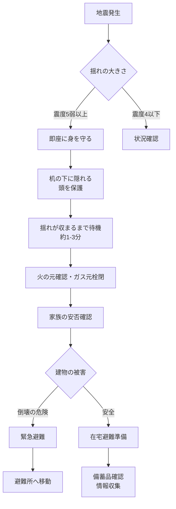

# 防災マニュアル - 神戸市六甲アイランド4人家族版

## 📊 家族構成と緊急連絡先

### 👨‍👩‍👧‍👦 家族情報

| 家族 | 名前 | 生年月日 | 備考 |
|------|------|----------|------|
| 父 | 涼平 | 1985年10月25日 | 職場：大阪池田市 |
| 母 | 可奈 | 1985年11月22日 | - |
| 長女 | あかり | 2016年11月1日 | 小学生 |
| 長男 | 陽太 | 2019年1月28日 | 小学生 |

### 📞 緊急連絡先一覧

| 種別 | 連絡先 | 電話番号/URL | 備考 |
|------|--------|-------------|------|
| **緊急通報** | 消防 | 119 | 火事・救急 |
| | 警察 | 110 | 事件・事故 |
| | 災害用伝言ダイヤル | 171 | 録音：171+1+自宅番号<br>再生：171+2+自宅番号 |
| **実家** | 井口家 | - | 神戸市西区学園東町 |
| | 白波瀬家 | - | 神戸市西区学園西町 |
| **医療機関** | 六甲アイランド病院 | 078-858-1111 | - |
| | ベイシェラトン隣接クリニック | - | - |
| **防災情報** | 神戸市防災 | [city.kobe.lg.jp](https://www.city.kobe.lg.jp/) | - |
| | 六甲アイランドハザードマップ | [rokuaibiyori.com](https://rokuaibiyori.com/hazardmap/) | - |
| **ライフライン** | 関西電力 | [kepco.co.jp](https://www.kepco.co.jp/) | 停電情報 |
| | 大阪ガス | [osakagas.co.jp](https://www.osakagas.co.jp/) | - |
| | 神戸市水道局 | [city.kobe.lg.jp](https://www.city.kobe.lg.jp/a84055/) | - |

---

## 🎒 防災備蓄品チェックリスト

### 📦 基本防災グッズ（家族4人分）

| カテゴリー | 品目 | 必要数量 | ✓ | 備考 |
|------------|------|----------|---|------|
| **照明・通信** | LED懐中電灯 | 4本 | □ | 各人1本 |
| | 乾電池（単3） | 20本 | □ | 3ヶ月毎確認 |
| | 乾電池（単4） | 20本 | □ | 3ヶ月毎確認 |
| | 手回し充電式ラジオ | 1台 | □ | - |
| | モバイルバッテリー | 4個 | □ | 10,000mAh以上推奨 |
| | ポータブル電源 | 1台 | □ | 1000Wh以上・リン酸鉄推奨 |
| | ソーラーパネル | 1枚 | □ | ポータブル電源充電用 |
| **安全用品** | ヘルメット（大人用） | 2個 | □ | - |
| | ヘルメット（子供用） | 2個 | □ | - |
| | ホイッスル | 4個 | □ | 各人1個 |
| | 軍手 | 4組 | □ | - |
| | マスク（大人用） | 50枚 | □ | - |
| | マスク（子供用） | 30枚 | □ | - |
| **医療・衛生** | 救急用品セット | 1式 | □ | 消毒薬・絆創膏等 |
| | 常備薬 | 7日分 | □ | 家族分・処方薬含む |
| | 体温計 | 1本 | □ | - |
| | ウェットティッシュ | 10個 | □ | アルコール・ノンアルコール |
| | トイレットペーパー | 20ロール | □ | - |
| | 簡易トイレ | 50回分 | □ | - |
| **その他** | 現金（小銭含む） | 3万円 | □ | 千円札・百円玉多め |
| | 重要書類コピー | 1式 | □ | 防水袋に保管 |

### 🍱 食料・水の備蓄（ローリングストック方式）

| 分類 | 品目 | 必要量<br>(7日分) | ✓ | 消費期限 | 備考 |
|------|------|------------------|---|----------|------|
| **飲料水** | 2Lペットボトル | 42本 | □ | _____ | 1人1日3L×4人×7日 |
| | 給水タンク | 20L×2個 | □ | - | 折りたたみ式OK |
| **主食** | 無洗米 | 10kg | □ | _____ | - |
| | レトルトご飯 | 21パック | □ | _____ | 1日3食×7日分 |
| | カップ麺 | 20個 | □ | _____ | ローリング推奨 |
| | 乾パン | 10箱 | □ | _____ | - |
| **おかず** | レトルトカレー等 | 30袋 | □ | _____ | ローリング推奨 |
| | 缶詰（魚） | 20缶 | □ | _____ | ツナ・サバ等 |
| | 缶詰（肉） | 15缶 | □ | _____ | - |
| | 缶詰（野菜・果物） | 15缶 | □ | _____ | - |
| **調理器具** | カセットコンロ | 1台 | □ | - | - |
| | カセットボンベ | 10本 | □ | _____ | 1本で約60分使用可 |
| | 紙皿・紙コップ | 各50個 | □ | - | - |
| | 割り箸 | 100膳 | □ | - | - |

### 👶 子供用防災リュック内容

| 品目 | あかり用 | 陽太用 | 備考 |
|------|----------|---------|------|
| **必須情報** | | | |
| 緊急連絡先カード | □ | □ | ラミネート加工・首掛け紐付き |
| 家族写真 | □ | □ | はぐれた時の確認用 |
| お薬手帳コピー | □ | □ | アレルギー情報含む |
| **安心グッズ** | | | |
| お気に入りのぬいぐるみ | □ | □ | 小さいもの1個 |
| 折り紙・お絵かきセット | □ | □ | 気を紛らわせる用 |
| **実用品** | | | |
| LEDライト（軽量） | □ | □ | 首掛けタイプ |
| ホイッスル | □ | □ | ランドセルに常備 |
| マスク（10枚） | □ | □ | 子供用サイズ |
| ティッシュ（5個） | □ | □ | ポケットティッシュ |
| 飴・ラムネ | □ | □ | エネルギー補給用 |
| 小銭（500円） | □ | □ | 公衆電話用（高学年） |
| **総重量目安** | 約2kg | 約1.5kg | 体重の10-15%以内 |

---

## 🗺️ 六甲アイランド防災マップ

### 📍 避難所配置図

<svg viewBox="0 0 600 800" xmlns="http://www.w3.org/2000/svg">
  <!-- 背景 -->
  <rect width="600" height="800" fill="#f0f8ff" stroke="#4169e1" stroke-width="3"/>
  
  <!-- タイトル -->
  <text x="300" y="30" font-size="24" font-weight="bold" text-anchor="middle" fill="#000080">
    六甲アイランド避難所マップ
  </text>
  
  <!-- 方位記号 -->
  <g transform="translate(300, 70)">
    <line x1="0" y1="0" x2="0" y2="-25" stroke="#000" stroke-width="2" marker-end="url(#arrow)"/>
    <text x="0" y="-30" font-size="14" text-anchor="middle">北</text>
  </g>
  
  <!-- 矢印マーカー定義 -->
  <defs>
    <marker id="arrow" markerWidth="10" markerHeight="10" refX="0" refY="3" orient="auto">
      <polygon points="0 0, 10 3, 0 6" fill="#000"/>
    </marker>
  </defs>
  
  <!-- 津波浸水想定区域（東側） -->
  <rect x="400" y="450" width="180" height="330" fill="#ffe4e1" stroke="#ff6347" stroke-width="2" stroke-dasharray="5,5" opacity="0.7"/>
  <text x="490" y="620" font-size="16" font-weight="bold" text-anchor="middle" fill="#ff0000">
    ⚠️ 東側エリア
  </text>
  <text x="490" y="640" font-size="12" text-anchor="middle" fill="#ff0000">
    津波浸水想定区域内
  </text>
  <text x="490" y="660" font-size="12" text-anchor="middle" fill="#ff0000">
    (企業・工場地域)
  </text>
  
  <!-- City Hill 住宅地域（安全エリア） -->
  <rect x="80" y="200" width="300" height="400" fill="#e6ffe6" stroke="#228b22" stroke-width="2" opacity="0.5"/>
  <text x="230" y="230" font-size="16" font-weight="bold" text-anchor="middle" fill="#006400">
    🏘️ City Hill 住宅地域
  </text>
  <text x="230" y="250" font-size="12" text-anchor="middle" fill="#006400">
    [津波浸水想定区域外]
  </text>
  
  <!-- 六甲アイランド高校 -->
  <rect x="150" y="120" width="160" height="50" fill="#4169e1" stroke="#000080" stroke-width="2" rx="5"/>
  <text x="230" y="145" font-size="14" font-weight="bold" text-anchor="middle" fill="white">
    🏫 六甲アイランド高校
  </text>
  <text x="230" y="162" font-size="10" text-anchor="middle" fill="white">
    (津波時緊急避難場所)
  </text>
  
  <!-- 六甲アイランド小学校 -->
  <rect x="150" y="300" width="160" height="50" fill="#4169e1" stroke="#000080" stroke-width="2" rx="5"/>
  <text x="230" y="325" font-size="14" font-weight="bold" text-anchor="middle" fill="white">
    🏫 六甲アイランド小学校
  </text>
  <text x="230" y="342" font-size="10" text-anchor="middle" fill="white">
    (津波時緊急避難場所)
  </text>
  
  <!-- 自宅位置 -->
  <circle cx="230" cy="400" r="20" fill="#ffd700" stroke="#ff8c00" stroke-width="3"/>
  <text x="230" y="405" font-size="16" text-anchor="middle">🏠</text>
  <text x="230" y="430" font-size="12" text-anchor="middle" fill="#000">
    自宅位置
  </text>
  
  <!-- 向洋小学校 -->
  <rect x="150" y="480" width="160" height="50" fill="#4169e1" stroke="#000080" stroke-width="2" rx="5"/>
  <text x="230" y="505" font-size="14" font-weight="bold" text-anchor="middle" fill="white">
    🏫 向洋小学校
  </text>
  <text x="230" y="522" font-size="10" text-anchor="middle" fill="white">
    (W3-W9地区担当)
  </text>
  
  <!-- 神戸ファッションプラザ -->
  <rect x="120" y="650" width="220" height="50" fill="#9370db" stroke="#4b0082" stroke-width="2" rx="5"/>
  <text x="230" y="675" font-size="14" font-weight="bold" text-anchor="middle" fill="white">
    🏢 神戸ファッションプラザ
  </text>
  <text x="230" y="692" font-size="10" text-anchor="middle" fill="white">
    (一時避難場所・上層階)
  </text>
  
  <!-- 凡例 -->
  <g transform="translate(20, 720)">
    <text x="0" y="0" font-size="12" font-weight="bold">凡例：</text>
    <rect x="0" y="10" width="30" height="15" fill="#e6ffe6" stroke="#228b22"/>
    <text x="35" y="22" font-size="11">安全区域</text>
    <rect x="100" y="10" width="30" height="15" fill="#ffe4e1" stroke="#ff6347"/>
    <text x="135" y="22" font-size="11">津波浸水想定区域</text>
    <rect x="240" y="10" width="30" height="15" fill="#4169e1"/>
    <text x="275" y="22" font-size="11">避難所</text>
  </g>
  
  <!-- 距離スケール -->
  <g transform="translate(450, 750)">
    <line x1="0" y1="0" x2="100" y2="0" stroke="#000" stroke-width="2"/>
    <line x1="0" y1="-5" x2="0" y2="5" stroke="#000" stroke-width="2"/>
    <line x1="100" y1="-5" x2="100" y2="5" stroke="#000" stroke-width="2"/>
    <text x="50" y="20" font-size="11" text-anchor="middle">500m</text>
  </g>
</svg>

### 🚶 避難経路と所要時間

| 避難先 | 距離 | 徒歩時間 | 経路 | 備考 |
|--------|------|----------|------|------|
| 向洋小学校 | 500m | 約7分 | 最短ルート | 第1避難所 |
| 六甲アイランド小学校 | 800m | 約10分 | City Hill経由 | 津波時 |
| 六甲アイランド高校 | 1.2km | 約15分 | 北ルート | 津波時 |
| 神戸ファッションプラザ | 600m | 約8分 | 商業地区経由 | 一時避難 |

---

## ⏰ 災害発生時の行動フローチャート

### 🌊 地震発生時のタイムライン



### ⏱️ 時系列別行動指針

| 時間 | フェーズ | 主な行動 | チェック項目 |
|------|----------|----------|--------------|
| **0-1分** | 発生直後 | 身の安全確保 | □ 頭部保護<br>□ 落下物回避 |
| **1-3分** | 揺れ収束 | 初期対応 | □ 火元確認<br>□ 出口確保 |
| **3-10分** | 安否確認 | 家族確認 | □ 家族の無事<br>□ 近隣の状況 |
| **10-30分** | 情報収集 | 被害確認 | □ 建物被害<br>□ ライフライン |
| **30分-3時間** | 判断 | 避難判断 | □ 在宅/避難<br>□ 持出品準備 |
| **3-6時間** | 行動 | 避難実施 | □ 避難所到着<br>□ 安否連絡 |
| **6-24時間** | 安定化 | 生活確保 | □ 食料・水<br>□ 情報更新 |
| **1-3日** | 継続 | 避難生活 | □ 健康管理<br>□ 衛生管理 |
| **3-7日** | 復旧 | 生活再建準備 | □ 片付け<br>□ 手続き |

---

## 🚗 帰宅困難者対策（涼平用）

### 📊 大阪池田市→六甲アイランド帰宅ルート

```
【徒歩帰宅ルート図】

出発：大阪池田市（職場）
  ↓ 
[5km] 豊中市（帰宅支援ステーション多数）
  ↓ 国道176号線
[8km] 尼崎市
  ↓
[7km] 西宮市（中継地点・休憩推奨）
  ↓ 国道43号線
[10km] 芦屋市
  ↓
[10km] 神戸市東灘区
  ↓ 六甲ライナー沿い
[5km] 六甲アイランド（自宅）

総距離：約45km（徒歩10-12時間）
```

### 🎒 職場備蓄品リスト

| カテゴリー | 品目 | 数量 | ✓ | 更新日 |
|------------|------|------|---|--------|
| **移動用品** | 歩きやすい靴 | 1足 | □ | _____ |
| | 靴下（予備） | 3足 | □ | _____ |
| | レインコート | 1着 | □ | _____ |
| **装備品** | LEDライト | 1個 | □ | _____ |
| | 予備電池 | 1式 | □ | _____ |
| | 地図（紙） | 1部 | □ | _____ |
| | モバイルバッテリー | 2個 | □ | _____ |
| **食料・水** | 水500ml | 6本 | □ | _____ |
| | カロリーメイト等 | 10個 | □ | _____ |
| | 塩飴 | 1袋 | □ | _____ |
| **医療品** | 絆創膏 | 10枚 | □ | _____ |
| | 鎮痛剤 | 1箱 | □ | _____ |
| **その他** | 現金 | 1万円 | □ | _____ |
| | マスク | 10枚 | □ | _____ |
| | 手袋 | 1組 | □ | _____ |

### 📱 帰宅支援サービス

| サービス名 | URL/アプリ | 機能 |
|------------|------------|------|
| 関西広域連合帰宅支援ポータル | [kansai-kitaku.jp](https://kansai-kitaku.jp/) | ステーション検索 |
| 帰宅困難者NAVI | スマホ対応 | ルート案内 |
| 神戸市帰宅困難者支援システム | 2024年4月運用開始 | 一時滞在施設案内 |
| 災害時帰宅支援ステーション | 29事業者協定 | コンビニ・外食店で支援 |

---

## 📋 定期点検スケジュール

### 月次点検（毎月1日実施）

| 項目 | 1月 | 2月 | 3月 | 4月 | 5月 | 6月 | 7月 | 8月 | 9月 | 10月 | 11月 | 12月 |
|------|-----|-----|-----|-----|-----|-----|-----|-----|-----|------|------|------|
| 懐中電灯 | □ | □ | □ | □ | □ | □ | □ | □ | □ | □ | □ | □ |
| 乾電池 | □ | □ | □ | □ | □ | □ | □ | □ | □ | □ | □ | □ |
| ラジオ | □ | □ | □ | □ | □ | □ | □ | □ | □ | □ | □ | □ |
| 救急用品 | □ | □ | □ | □ | □ | □ | □ | □ | □ | □ | □ | □ |
| モバイルバッテリー | □ | □ | □ | □ | □ | □ | □ | □ | □ | □ | □ | □ |
| ポータブル電源 | □ | □ | □ | □ | □ | □ | □ | □ | □ | □ | □ | □ |

### 年次総点検（9月1日防災の日）

| 大項目 | チェック内容 | 2024 | 2025 | 2026 |
|--------|--------------|------|------|------|
| **備蓄品** | 食料賞味期限 | □ | □ | □ |
| | 水の入替 | □ | □ | □ |
| | 医薬品期限 | □ | □ | □ |
| **装備品** | 衣類サイズ | □ | □ | □ |
| | 靴サイズ（子供） | □ | □ | □ |
| **計画** | 避難経路確認 | □ | □ | □ |
| | 家族会議開催 | □ | □ | □ |
| | マニュアル更新 | □ | □ | □ |
| **訓練** | 避難訓練参加 | □ | □ | □ |
| | 消火器使用訓練 | □ | □ | □ |

---

## 📝 重要メモ

### ⚠️ 六甲アイランド特有の注意事項

| 項目 | 内容 |
|------|------|
| **基本方針** | 在宅避難が原則（南海トラフ地震想定） |
| **津波リスク** | 住宅地域（City Hill周辺）は浸水想定区域外<br>東側エリア（企業・工場）は浸水想定区域内 |
| **アクセス** | 六甲ライナー・六甲大橋が使用不可時は孤立リスクあり |
| **避難所収容** | 向洋小学校は西コート住民集中の可能性大 |

### 📅 更新履歴

| 更新日 | 主な更新内容 |
|--------|--------------|
| 2025-08-15 | 図表形式に全面改訂、最新防災情報反映 |
| 2024-07-04 | 初版作成 |

---

**次回見直し予定：2025年9月1日（防災の日）**